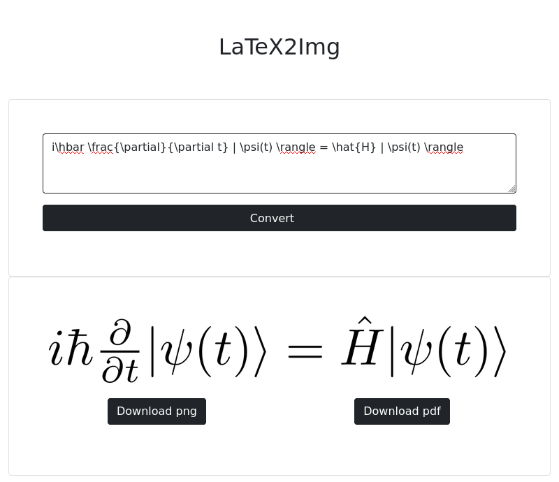

# latex2img_rs

Proof-of-concept LaTeX to img conversion application written in Rust using [axum](https://github.com/tokio-rs/axum) and [htmx](https://github.com/bigskysoftware/htmx).




## Quickstart

### Cargo

``` console
cargo run
```

### Docker

>:warning: It takes some time when installing TeX packages.

```
docker image build -t latex2img_rs .
docker run -p 3000:3000 -it latex2img_rs:latest
```